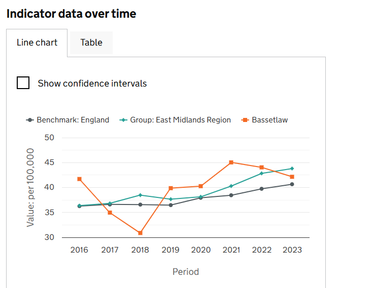
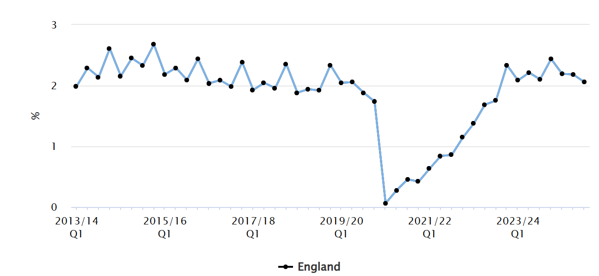
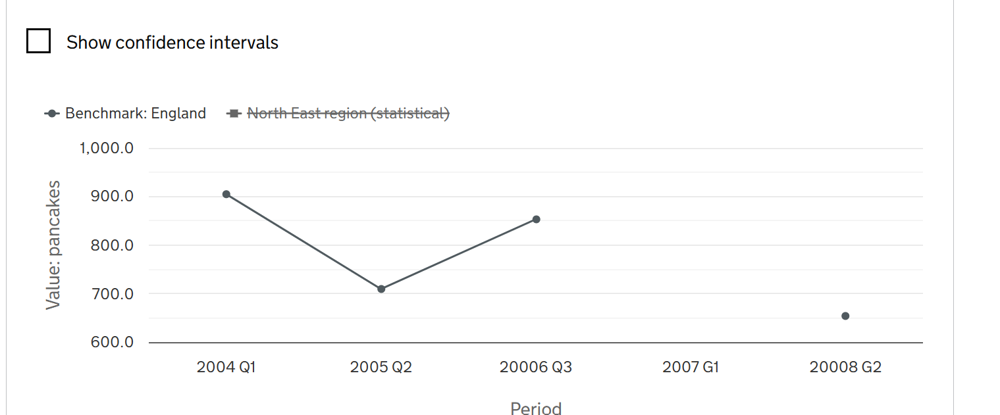
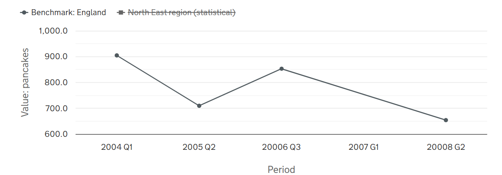

# Investigation into the Complex Time Period Reporting

One of the key requirements is to enable the ability to display various complex date periods on the line chart and data tables. Currently, in next generation fingertip POC , we are only displaying the data for calendar years only, and some of it is being displayed incorrectly, ignoring the indicators "year type".

The fingertips current website, uses this various year types to compute and display the period label.


## Reporting Year Types

These are the different time period formats currently in use:
| Year Type | Indicator ID | Period Format | Frequency | TBC |
|  ---      |---        |---     | ---         |  --- |
| Calendar  |  |  |  |
| Financial | 20401 | e.g 1998, 1999, 2000,... |  1yr |
| Academic   | 91871 | e.g 2022/23, 2024/2025 | 1yr |
| Academic   | 92033 | e.g 2009/10 - 13/14,... | 5yrs |
| Financial Rolling Year – Quarterly   | 91041 | 2023/24 Q3 | Quarterly |
| Calendar Rolling – Quarterly   |  |  | |
| Calendar Rolling Year – Monthly   |  |  | |
| Financial Single Year – Cumulative Quarters   |  |  | |
| August–July   | 92860 | 2015, 2016 ... e.t.c | 1yr | yes |
| March–February   |  |  | |
| Financial Multi-Year – Cumulative Quarters   | 91112 | 2020/21 Q1 - 2020/21 Q2  | Quarterly |
| October–September   |  |  |  |
| Financial Rolling Year – Monthly   |  |  | |
| July–June   |  | e.g Jul 2009 - Jun 2010, Jul 2010 - Jun 2011 | 1yr |
| November–November   | 93015 |  2015/16, 2017/18 .... | 1yr |
| Financial Year Endpoint   | 93468 |  e.g 1998, 1999,... | Annual |


This spike is to find the approaches appropriate we have to take to be able to support this complex year reporting types, that can be discussed with the team.

### Goals

The goal is to propose how to handle the following:

- Required database changes  
- Whether the Time Period should be treated as its own dimension  
- Whether API changes are required  
- Frontend changes required, including:  
  - Handling different time periods in the Highcharts line chart (currently, years are treated as integers on the x-axis)  
  - Ensuring sorting still works in various areas  
  - How to display the period type  
- Agreement on which types of date periods should be supported for **FingertipsNext**  
- Documentation of proposed options (and ideally a recommendation) in Confluence

---
---

## Table of Contents

- [Problem Overview](#problem-overview)  
  - [The Current Charts](#CurrentChart)
  - [The Goals](#TheGoals)
- [Proposed Solutions](#proposed-solution)  
  - [Definitions](#definitions)  
  - [Solution A](#SolutionA)
    - [Database Creator](#DatabaseCreatorChangesOnSolutionA)
    - [Health Data](#health-data)  
    - [Field Types and Descriptions](#field-types-and-descriptions)  
  
  - [Solution B](#SolutionB)  
    - [Database Changes Required](#database-changes-required) 
    - [Data Fields Mapping](#field-types-and-descriptions)  
  - [Option C](#option-c)  
- [Period Label On HighChart](#PeriodLabelOnHighchart)
- []()
- [References](#references)

---

## Problem Overview
  -  As a user I want to be able to see different period labels base on the indicator on the charts and on data tables. 

At the moment , we are plotting  the y-values to the x-values (year as the period label ) as shown below.

### Current Chart



However, want we want is to make the chart period more dynamic, in this way we can accommodate different year types and the appropriate ticks on chart labels.

An example will be: 




## Proposed Solutions
Below is a list of the proposed solutions and the modules that would be affected if any of them is accepted.

#### Require Module Changes
| Component Name | Descriptions | Change Required |
| -- | -- | -- |
| DataCreator | Ingestion Module , we need to add new fields e.g TimePeriod , YearType | Yes |
| Database | The HealthMeasure point table will have to change to accommodate new types | Yes |
| Frontend | Any frontend component that is using year on a chart has to change to use the PeriodLabel instead | Yes |
| Backend API | Allow for new fields to be returned |  Yes |
| HighChart | Advance configuration on Highchart to allow tick labels on the charts to avoid stacking | Yes |


### Solution A (Recommended)
In this option A, I propose precomputing the "Time Period" fields during data ingestion into the current Fingertips database. 


#### Database Creator
  Currently, the database creator serves as a temporary data ingestion module for the next-generation database.
  The proposed solution suggests performing all period label computations within this module—if they are missing—prior to ingesting the timePeriod label into the Fingertips database, along with the year, as is currently being done.


##### Require fields need to compute the labels are shown below


| Field                         | Type   | Description                                                                                      | Required |
|------------------------------|--------|---------------------------------------------------------------------------------------------------|----------|
| **Indicator**.yearType       | string | Used to identify the indicator                                                                    | Yes      |
| **Indicator**.Frequency    | string | The name of the indicator                                                                           | Yes      |
| Time Period                  | string | The data point period label or period of collection                                               | Optional |
| **HealthData**               | struct |                                                                                                   |          |
| **HealthData**.TimePeriodSortable | int    | Contains the year, and the quarterly report it was reported  e.g 20100000                    | Yes      |
| **HealthData**.TimePeriodRange  | string | Reporting period range. For calendar years we have `1yr`; for financial, quarterly, etc , optional if we have the frequency     | Optional |

---
 If we are doing the pre-calculation in the Data Creator/Data Ingestion module , we don't really need to export all the fields to our database.
  We just 've to create a new fields called PeriodLabel that will be pre-computed and export to our database to be use as the `Period Label`. 

```csharp
// File: DataCreator/DataCreator/DataFileReader.cs
// This field need a good refactor to make it easy to be use in the future.
var indicatorData = new HealthMeasureEntity
{
    IndicatorId = indicatorId,
    PeriodLabel = periodLabel, // After pre-computed 
    ...
};
allData.Add(indicatorData);
```

##### The Expected Output
- `PeriodLabel`: the displayable labels for the data points

#### Database Schema  Changes
 The only important changes here is adding a new field on the HealthMeasure Table.

 ```sql
CREATE TABLE [dbo].[HealthMeasure](
    [HealthMeasureKey] [int] IDENTITY(1,1) NOT NULL, 
    [PeriodLabel] NVARCHAR(30)  NOT NULL, 
    ...
)
```

#### API Endpoint Changes
Adding a new PeriodLabel to the HealthDataPoint 

```TypeScript
export interface HealthDataPoint {
    periodLabel: string, 
    ...
}
```
---


### Solution B

Solution B is similar to Solution A; however, instead of performing the period label pre-calculation in the DataCreator module before ingestion, we can ingest the required fields and recalculate the period labels either at the API level or on the frontend before displaying them.


### Database Changes
We need to track the new fields at the database level to enable calculation or recalculation. 
Furthermore, these are the field needed for the re-calculation, shown below:

| Field                  | Type   | Source | Destination |
|----------------------  |--------| ---  | --- |
| **Indicator**.yearType | string | Pholio Database | fingertips.IndicationDimension |
| Time Period Sortable   | string    | CSV Database | fingertips.HealthMeasure|
| PeriodLabel  | string  | Calculated Field | fingertips.HealthMeasure |
| Time Period Range      | string | CSV Database | fingertips.IndicationDimension|

**Note** : *Depending of how we want to calculate the pre-computations this can be done by SQL functions  or C# or Typescript at the frontend level.*

---

After porting this fields to the next generation database the same calculations for the period label has to be carryout and the period label has to be updated.


### Optional C
 This is not an option at all , but we can decided to do nothing at all :) 


## Frontend Investigation:  Highcharts Changes

Currently, the frontend only displays years on the x-axis without labels. Instead, what we want is the ability to display **custom labels** (e.g., "Q1 2010", "Q2 2015") alongside the tick marks. This will allow us to represent different time ranges on the x-axis of the Highcharts chart.

### Challenges

- How do we display **custom labels** instead of relying solely on year values?
- Since the chart is a **multi-series line chart**, we want the actual **x-values to correspond to years**, not the label index. That means the value-to-year mapping should still be done based on the tick index, even though the label may show something different.


# Options 

## Option 1: Using Highcharts `categories` x-axis Type

This option is proposal the use for categories type for the x-axis.

The current line chart contains multiple series and for this reason Highchart recommends using a category types in the x-axis.  But if we rely solely on `category` type for the x-axis, the chart will plot data points based on the **position in the category array**, which can lead to incorrect plotting when series have data for different years.


### For Example:

```text
Series A = [2010, 8.35], [2015, 9.0]  
Series B = [2010, 7.35], [2017, 4.0]  
```

We might compute the categories as:

```text
Categories C = [2010, 2015, 2017]
```

However, Highcharts will plot the data like this:

- Series A:
  - Point 1 = C[0], A[0] → 2010, 8.35  
  - Point 2 = C[1], A[1] → 2015, 9.0

- Series B:
  - Point 1 = C[0], B[0] → 2010, 7.35  
  - Point 2 = C[1], B[1] → 2017, 4.0 ❌ (wrong mapping!)

This results in an incorrect chart because HighCharts aligns points **by index**, not by year.

To be able to rectify this problem the use of `"Null Connection"` concept should be used.
Luckily HighChart provide a way to configured Null connection points"

### HighChart connectNulls Configuration`
But, before we can do that , we have to pre re-compute all the time points across all series 
and generate an array that aligns with the labels . For year points where a series has no data, we insert `null`.

This approach breaks the lines by default, producing a broken chart like this:
**Note**: Ignore the label at this point—I'm just demonstrating that we can use a string as label. 


To rectify this we can configured high chart to connect the null points as shown below:

```ts
plotOptions: {
  series: {
    animation: false,
    connectNulls: true
  },
}
```
However, in the current website for fingertips. The charts have the same problem where points are broken when there are not data points at the label locations. 

**Note**: Ignore the label at this point—I'm just demonstrating that we can use a string as label. 



With this, the chart will connect data points seamlessly, preserving the line even with missing data. Now, we can use **label-based periods** on the x-axis without breaking the line.

### Option 2 : using 'DateTime' x-axis  

This option proposes using the date-time x-axis type. This enables the x-axis to treated as dates, allowing us to override the labels with periods based on the mappings.

However, we need an additional label.formatter function to override the tick labels and replace them with the custom labels.

####  HighChart Configuration

 
 The formatter function
 ```typescript
    xAxis: {
        type: 'datetime',
        tickInterval: 10 * 365 * 24 * 3600 * 1000,
        labels:{
         formatter: function () {
            const customLabels = {
                1960: 'A',
                1970: 'B',
                1980: 'C',
                1990: 'D',
                2000: 'E'
            };
            const year = new Date(this.value).getFullYear();
            return customLabels[year] || "N/A"
          }
        },
 ```

Highcharts only supports certain types of date formats—specifically UTC formats such as YYYY, MM, and DD. For this reason, based on the data we currently have, the best approach when providing the series data is to convert it to the correct format, as shown below:


```typescript
series: [
        {
            name: 'Series A',
            data: [
                [Date.UTC(1960,0,1), 0.035],
                [Date.UTC(1970,0,1), 0.1],
                [Date.UTC(1980,0,1), 0.15],
                [Date.UTC(1990,0,1), 0.76]
            ]
        },
```
The current Fingertips new generation represents time as an integer. To use it in the data series x-axis, we need to perform a conversion, as shown above."

### Final Steps

1. Extract and sort **all unique label periods** from all series.
2. If a label period does not exist in a particular series, insert `null` at that index.
3. Configure Highcharts to use `categories` (i.e., the label periods) instead of direct `x,y` data.


## Label Period Computations
  Still coming...


## Suggested Technical Tickets

This can be broken down into three tasks:

- **Ingestion Task**: Precompute the period labels during data ingestion & creating the database schema needed.  
- **Backend Task**: Update the endpoint and database sql query to include period labels in the returned health points.  
- **Frontend Task**: Apply advanced Highcharts configuration and refactor existing components to support the new period label instead of year.

   

## Conclusion
All data periods should be supported, and the recommended scalable approach is Option A, which allows these data periods to be precomputed before being ingested into the database.


