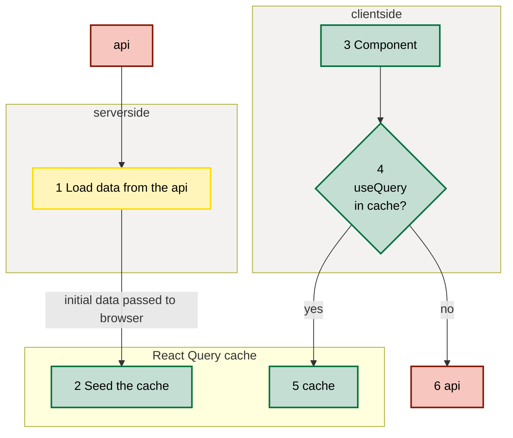

# Shallow url updates and React Query

## What are shallow url updates?

Allows javascript enabled devices to store state in the url and therefore benefiting from improved user experience and
performance whilst at the same time maintaining a shareable, reloadable link which renders server side.

## What is ReactQuery

- Library providing hook based management and caching of asynchronous tasks - typically API requests
- Same data can be requested by many components without multiple loading, by use of `queryKey`
- In combination with the cache seeding we do not load the same data again when the page renders
- With cache seeding the same components can render on the server without js on the client

[More about ReactQuery](https://tanstack.com/query/latest)

## benefits

- **increased performance**: loads quicker, reduced bandwidth
- **improved user experience**: only the parts of the page that need to change do so - quickly
- **fewer calls to the API**: no need to re-fetch the same data between pages
- **renders serverside**, without javascript needing to be on the client
- **simpler code to maintain**: less [prop drilling](https://www.freecodecamp.org/news/prop-drilling-in-react-explained-with-examples/)

## 'use client'

- rendered serverside AND clientside
- can use hooks such as `useState`, `useEffect` etc
- will render serverside but will use the default state of `useState` and `useEffect` will never fire
- **ALL** childNodes will be treated the same, regardless if they have `'use client'` or not
- Assumption: all data passing as props between server side pages and the first `'use client'` requires the data to be
  encoded and embedded into the http response

## Suggested pattern

[Demo](http://localhost:3000/shallow) to show how we can leverage large chunks of code from the exist site without
changing them e.g. the OneIndicatorPlots but switch the filtering to one that works without js and without reloading
everything everytime the user makes a selection.

### Server side

1. Only the app page, in this case `app/shallow/page` is purely rendered serverside.
2. Anticipates all api calls needing to be made in order to render the page and seeds ReactQuery client

### Client side

3. Component renders and uses `useQuery` to make API calls to get the data that it needs
4. `useQuery` checks if the data identified by `queryKey` in this case url is already available
5. Data is available in cache and component can continue to render. Renders server side too.
6. Data is loaded from the api by the client browser and renders without reloading unnecessary data